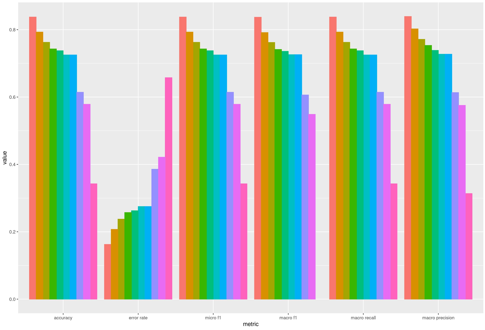

# Лабораторная работа №5 (Классификация текстов)

## Синопсис лекции

**Классификация** - задача, решаемая методами машинного обучения и заключающаяся в присваивании моделью значения некоторого категориального признака каждому элементу выборки. Данная задача решается методами обучения с учителем (`supervised learning`).  
**SVM** - семейство методов построения моделей машинного обучения для решения задач классификации, регрессии и обнаружения выбросов путем нахождения в процессе обучения границы между подмножествами экземпляров выборки в многомерном признаковом пространстве.  
**Kernel methods** - класс методов построения моделей машинного обучения, основанных на применении ядерных функций (`kernel functions`), позволяющих оптимизировать использование вычислительных ресурсов путем замены операции формирования описания элементов выборки в другом признаковом пространстве операцией непосредственного подсчета расстояния между двумя объектами как если бы они находились в целевом признаковом пространстве.  
**One-vs-all** - метод построения моделей машинного обучения для решения задачи многоклассовой классификации путем комбинации нескольких классификаторов, каждый из которых обучается таким образом, чтобы отделять объекты, относящиеся к одному из классов, от объектов, относящихся к другим классам. Для осуществления многоклассовой классификации требуется обучение `N` классификаторов, где `N` - количество классов.  
**One-vs-one** - метод построения моделей машинного обучения для решения задачи многоклассовой классификации путем комбинации нескольких классификаторов, каждый из которых обучается таким образом, чтобы отделять объекты, относящиеся к одному из классов, от объектов, относящихся к одному из оставшихся классов. Для осуществления многоклассовой классификации требуется обучение `N * (N - 1)` классификаторов, где `N` - количество классов.  
**Accuracy** - базовая метрика, позволяющая грубо оценить качество классификации путем подсчета доли верно классифицированных элементов выборки.  

## Задание

1. С использованием полученных в результате выполнения [третьей лабораторной работы](/tasks/task-03) векторных представлений документов осуществить эксперименты с моделью `SVM` для многоклассовой классификации. Допускается использовать библиотечную реализацию. В качестве `kernel function` допускается выбор любого преобразования (в простейшем случае - линейное, т.е. отсутствие преобразования). Для получения дополнительных баллов по данному пункту предлагается сравнить несколько (2 или более) альтернативных `kernel functions` либо сравнить модель `SVM` с какой-либо другой моделью на выбор (например, с какой-либо базовой типа `MLP` или более сложной, наподобие `Bert`). Если выбранной модели потребуется подать на вход векторные представления токенов, а не целого документа, то требуется подавать векторные представления токенов, формируемые моделью, которая была обучена при выполнении [третьей лабораторной работы](/tasks/task-03). В каждом эксперименте необходимо менять количество эпох, в течение которых обучается модель, в конце каждого эксперимента зафиксировать значения по крайней мере следующих метрик (при подсчете метрик использование библиотечных методов не допускается), которые необходимо считать по тестовой выборке:
    * `precision`;
    * `recall`;
    * `f1-score`;
    * `accurracy`;
    * `training-time` (время обучения модели);
1. После выполнения экспериментов на основании полученных значений метрик сформулировать вывод о том, какое количество итераций является оптимальным, а также какая модель (или `kernel function`) показала лучшие результаты (в том случае, если в предыдущем пункте выполнялись эксперименты с несколькими моделями или `kernel functions`);
1. В соответствии с одним из следующих преобразований над векторными представлениями документов осуществить еще одну серию экспериментов над выбранной на предыдущем шаге моделью с использованием найденного оптимального значения для количества итераций (варианты приведены в порядке увеличения сложности реализации):
    * Отбросить несколько случайно выбранных элементов векторных представлений, зафиксировать характер зависимости значений метрик от количества отброшенных размерностей;
    * Сократить размерность векторных представлений до некоторого значения, зафиксировать характер зависимости значений метрик от новой размерности;
    * Добавить дополнительные размерности векторных представлений с использованием стандартных математических функций (`log`, `cos`, `sin` и т.д.), зафиксировать характер влияния нескольких модификаций на значения метрик;
    * В том случае, если на предыдущем шаге была выбрана модель, в архитектуре которой предусмотрены блоки формирования векторных представлений отдельных токенов (например, `Bert` или `Elmo`), выполнить две серии экспериментов и сравнить значения полученных метрик с исходными значениями:
        - подать на вход модели векторные представления токенов в виде единичных векторов, отметить, уменьшились или увеличились значения метрик;
        - уменьшить внутреннюю размерность модели и/или количество блоков, выполняющих преобразование исходных данных, найти оптимальные значения данных гиперпаметров модели.
